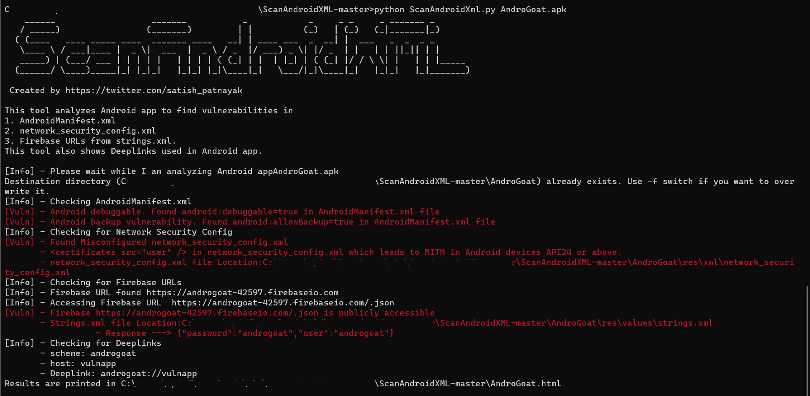

# ScanAndroidXML
This tool analyzes Android app to find vulnerabilities in
1. AndroidManifest.xml
2. network_security_config.xml
3. Firebase URLs from strings.xml.

This tool also shows Deeplinks used in Android app.

JDK and Python3 are required.

<b>*How to Install:* </b> 
<i>cd ScanAndroidXML  
pip install -r requirements.txt </i>

<b>*How to Run:*</b> 
Move apk file into SacnAndroidXML directory 
<i>python ScanAndroidXml.py &lt;apk file&gt;</i> 

This will print the results in terminal and generate results in html file. 

<b>*Sample Results:*</b> 

https://twitter.com/satish_patnayak

